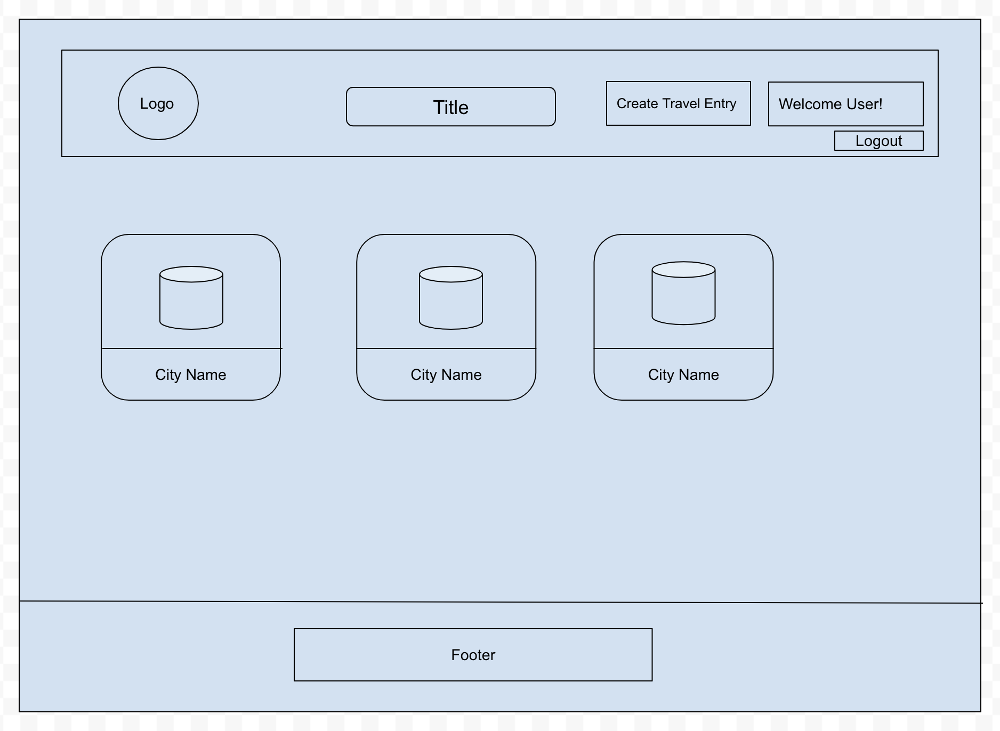
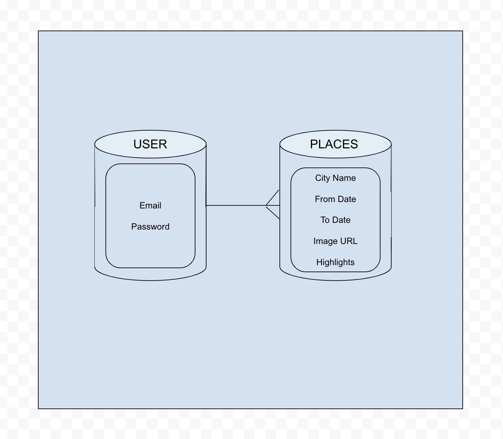
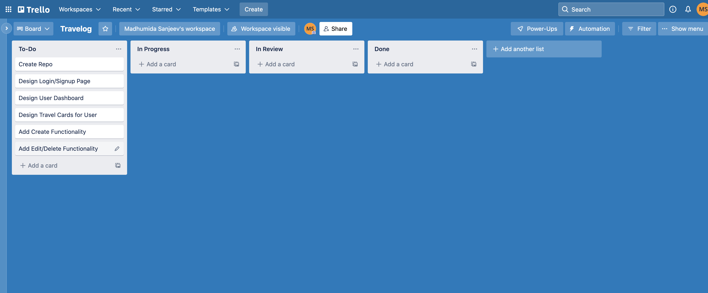
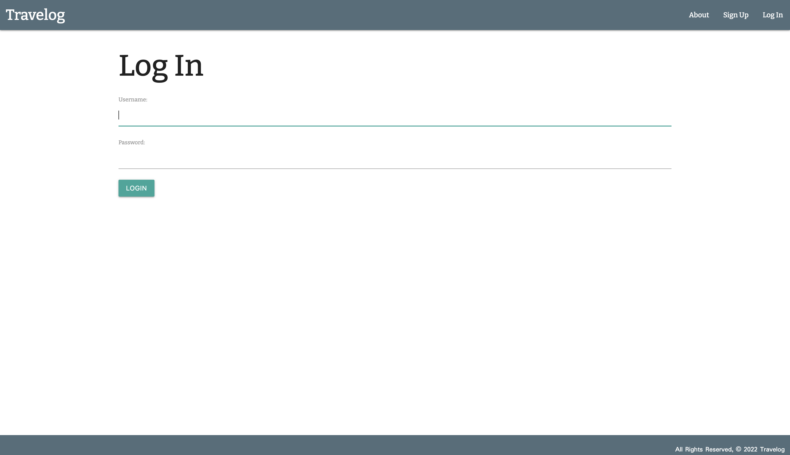
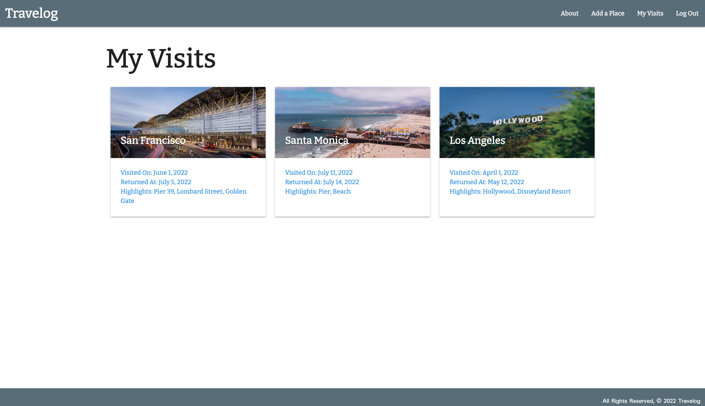
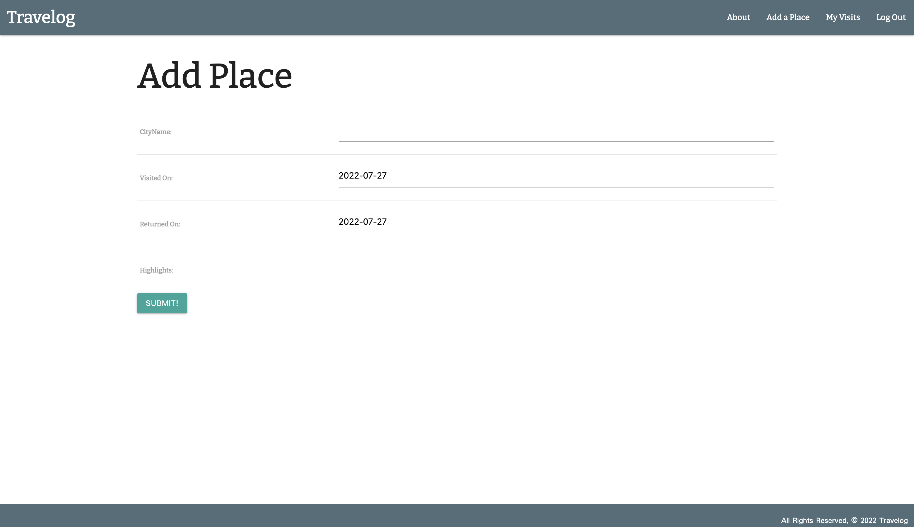
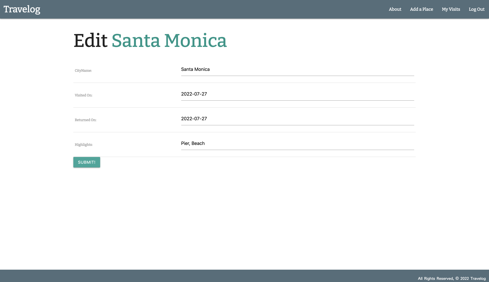
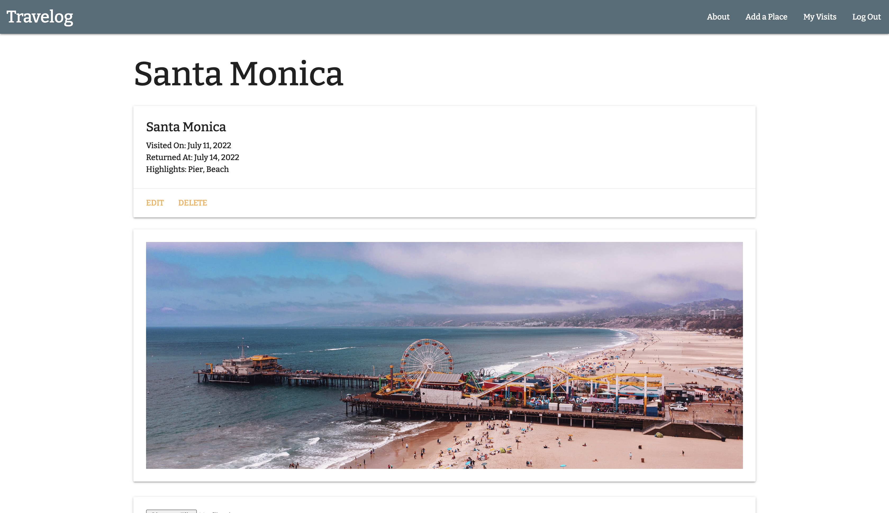

# Travelog

Travelog is a full CRUD Web application that stores and handles travel logs of users with authentication and authorization using Python and Django.

---

### Wireframes

### Trello

---

## Screenshots

### Login Page

### Home Page

### Create Page

### Edit Page

### Show Page

## User Stories

### As a user, I want to:
* see my visits displayed on a main page.
* sign up for an account.
* sign in and out of my account. 
* click on a card and view information about that place. 
* create a place visited 
* update or delete a place on card. 

---

## Technologies Used

### Backend

Python
AWS
PostgreSQL

### Frontend

Django 
Html
CSS

---

## Getting Started

[Click Here](https://github.com/madhu-mida/travelog) to see Repo.

[Click Here](https://trello.com/b/zgEqbinz/travelog) to view Trello Board.

[Click Here](https://travelog-ms-95.herokuapp.com/ ) to see deployed Heroku app.

---

## Future Enhancements

Add search feature